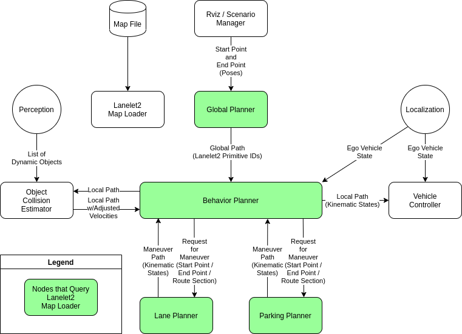

behavior_planner {#behavior_planner-package-design}
===========

This is the design document for the `behavior_planner` package.

# Purpose / Use cases
## Purpose
The purpose of the `behavior_planner` node is to convert global path into local trajectory for the controller to follow.

This includes three main functions:
* Convert the list of Semantic Map primitives provided in global path into sequence of trajectory points by querying relavant trajectory planners.
* Modify path velocity profile of trajectory so that vehicle stops before detected obstacles.
* Splitting splitting trajectory at gear change.
This is only meant to be temporal function until controller can handle a trajectory with reverse motion.

## Use Cases
### System Use Cases
Here are considered use cases:
* Departure: The vehicle must be able to depart from parking area, and must drive to closest lane for following lane driving.
* Lane Driving: The vehicle must drive along given lane defined in a semantic map. The vehicle should not protrude the lane polygon and should not exceed the speed limit of the lane.
* Parking: The vehicle must be able to park from closest lane after lane driving.

### Output Use Cases
The following modules are the users of the output from the 'behavior_planner':
* Controller: calculates control input to the vehicle_interface from the trajectory provided by the `behavior_planner`

# Design
The planner design is illustrated as follows.

The difficulty in trajectory planning is that the use cases and requirements for the planning changes depending on situations.
For example, the planner must consider going back and forth when planning parking trajectory, whereas such maneuver will be unnecessary when driving along lane.
Including all algorithms for different situation in a single node makes the planner complex and difficult to maintain in the long term.
In this design, core algorithm of trajectory calculation is split into different trajectory planning nodes, and the `behavior_planner` node will act as a manager of those nodes to create final trajectory.

The `behavior_planner` will convert global path into trajectory by following stopes:
1. Split global path into sections
2. For each sections, query appropriate trajectory planner nodes to calculate trajectory for each sections. 
3. Split returned trajectory at the point where moving direction changes.
4. pass splitted trajectory into velocity modifiers(i.e. object collision estimator) to optimize velocity.

## Assumptions / Known limits
### Limitations
Since the calculation of trajectory is split into sections and passed to different nodes for optimization, the final trajectory may not be globally optimal.

## Inputs / Outputs / API
### Inputs
* vehicle state
* global path
* semantic map

### Outputs
* Trajectory

### Action Calls
* PlanTrajectory
(We use action instead of service due to limitation of how ROS service calls is implemented)

### Service
* HADMapService
* ObjectCollisionEstimatorService

## Inner-workings / Algorithms

## Error detection and handling
<!-- Required -->

# Security considerations
<!-- Required -->
<!-- Things to consider:
- Spoofing (How do you check for and handle fake input?)
- Tampering (How do you check for and handle tampered input?)
- Repudiation (How are you affected by the actions of external actors?).
- Information Disclosure (Can data leak?).
- Denial of Service (How do you handle spamming?).
- Elevation of Privilege (Do you need to change permission levels during execution?) -->

# References / External links
<!-- Optional -->

# Future extensions / Unimplemented parts
<!-- Optional -->
* replace communcation to the trajectory planners with service calls instead of actions after synchronous service call is available

# Related issues
<!-- Required -->
